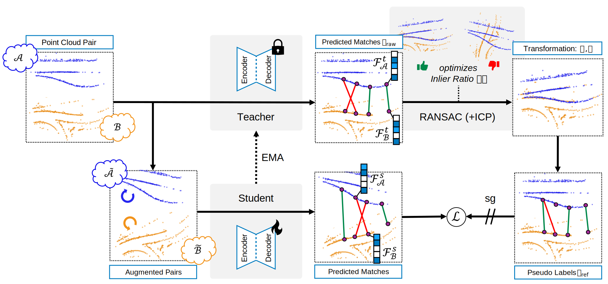
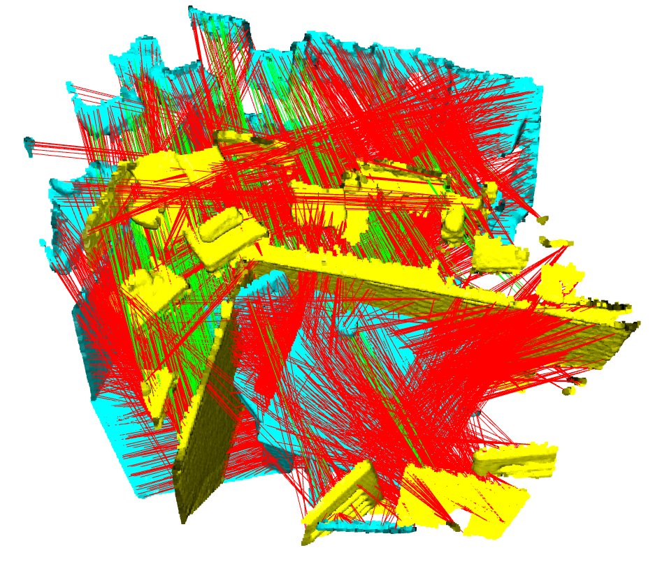
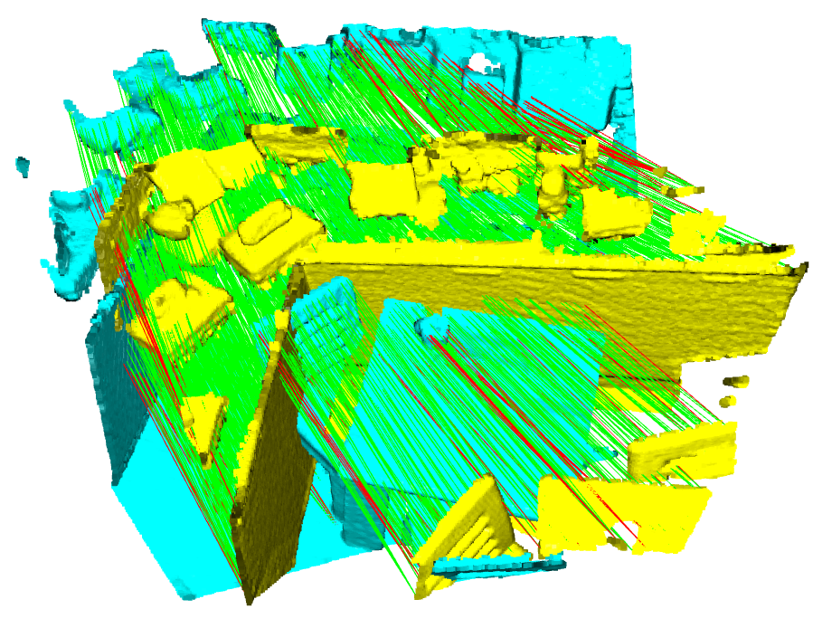

# DiReg: Unsupervised Point Cloud Registration with Self-Distillation [Oral at BMVC24]

This is the companion code for the DiReg algorithm reported in the paper
"Unsupervised Point Cloud Registration with Self-Distillation" by Christian Löwens et
al. accepted as oral at BMVC 2024 [[arxiv](http://arxiv.org/abs/2409.07558)]. The code allows the users to reproduce and extend the results reported in the
paper. Please cite the above work when reporting, reproducing or extending
the results.



## Purpose of the repository

This software is a research prototype, solely developed for and published as
part of the publication of DiReg. It will neither be maintained nor monitored in any way.

## Requirements
We tested our code with following environment:
- pip:
    - numpy=1.24.3
    - scipy=1.10.1
    - matplotlib=3.7.1
    - open3d=0.13.0
    - tensorboard=2.14.0
    - tensorboardX=2.6.2.2
    - future-fstrings=1.2.0
    - easydict=1.11
    - joblib=1.3.2
    - scikit-learn=1.3.0
    - configargparse=1.7
    - minkowskiengine=0.5.4 (see their [installation instructions](https://github.com/NVIDIA/MinkowskiEngine/tree/02fc608bea4c0549b0a7b00ca1bf15dee4a0b228?tab=readme-ov-file#pip))
    - pytorch3d=0.7.2 (see their [requirements](https://github.com/facebookresearch/pytorch3d/blob/bd52f4a408b29dc6b4357b70c93fd7a9749ca820/INSTALL.md#core-library) and [installation instructions](https://github.com/facebookresearch/pytorch3d/blob/bd52f4a408b29dc6b4357b70c93fd7a9749ca820/INSTALL.md#2-install-wheels-for-linux))
    - pyyaml=6.0.1
- conda-forge:
    - cudatoolkit=11.3.1
- pytorch
    - pytorch=1.11.0

## 3DMatch Dataset
Since our code builds on the repository of Self-supervised Geometric Perception (SGP), please use their reorganized 3DMatch dataset for training and testing. For this, please follow their instructions in [theNded/SGP/code/README.md](https://github.com/theNded/SGP/tree/63d33cc8bffde53676d9c4800f4b11804b53b360/code#datasets) and adjust the `dataset_path` in the corresponding config in `code/perception3d` (see next sections).

| Initial correspondences $\cal{C}_{\mathrm{raw}}$ | Refined correspondences $\cal{C}_{\mathrm{ref}}$ |
|:--------------------------:|:--------------------------:|
|  |  |


## Training
### DiReg
To train our model, execute:
```bash
python code/perception3d/train.py --config code/perception3d/config_direg.yml
```
Make sure all paths in the config are valid. For our proposed alternative without momentum teacher use `config_direg_no_momentum_teacher.yml` instead. The configurable parameters can be found in `adaptor.py` or `train.py`.
### Baselines
To train a baseline, use one of the other configs in `code/perception3d` except for SGP. In this case, please use `sgp.py` and `config_sgp.yml` instead.

## Evaluation
To test our model or a baseline, execute:
```bash
python code/perception3d/train.py --config code/perception3d/config_test.yml
```

## License

DiReg is open-sourced under the AGPL-3.0 license. See the
[LICENSE](LICENSE) file for details.

For a list of other open source components included in DiReg, see the
file [3rd-party-licenses.txt](3rd-party-licenses.txt). Our own contribution is summarized as a single commit in this repository.